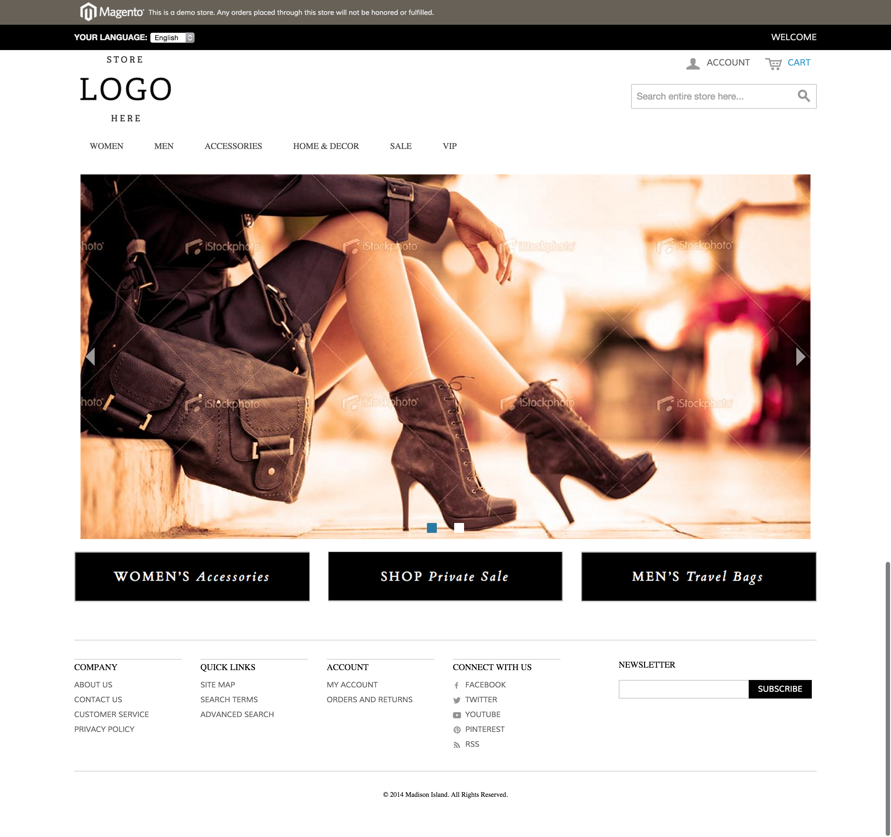

Meanbee MagehackTheme Extension
=====================

This is a demo theme for the [Meanbee_PersonalisedContent](https://github.com/MageHack/PersonalisedContent) extension.

Description
-----------
This demo theme installs demo styles, customers, orders and homepage setup to demo the [Meanbee_PersonalisedContent](https://github.com/MageHack/PersonalisedContent) extension.

Two customers

* ash@example.com password1
* tom@example.com password1

Ash has bought a product from the men category.
Tom has bought a product from the home category.

### Logged out

### Logged in as Ash

### Logged in as Tom

Support
-------
If you have any issues with this extension, open an issue on [GitHub](https://github.com/meanbee/Meanbee_PersonalisedContent/issues).

Contribution
------------
Any contribution is highly appreciated. The best way to contribute code is to open a [pull request on GitHub](https://help.github.com/articles/using-pull-requests).

Project Team
---------

* [Ash Smith](https://twitter.com/ashsmithco)
* [Tom Robertshaw](https://twitter.com/bobbyshaw)
* [Doug Ogisi](https://www.linkedin.com/pub/douglas-ogisi/1b/964/35b)
* [Shari Robertshaw](https://twitter.com/sharibary)

Licence
-------
[OSL - Open Software Licence 3.0](http://opensource.org/licenses/osl-3.0.php)

Copyright
---------
(c) 2015 Meanbee
